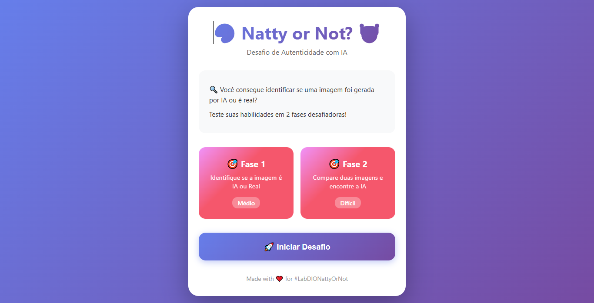
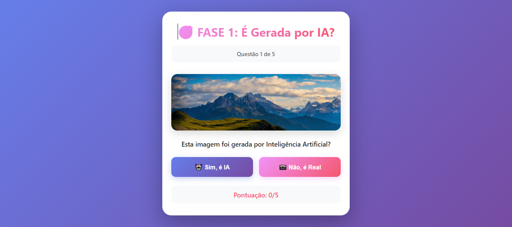
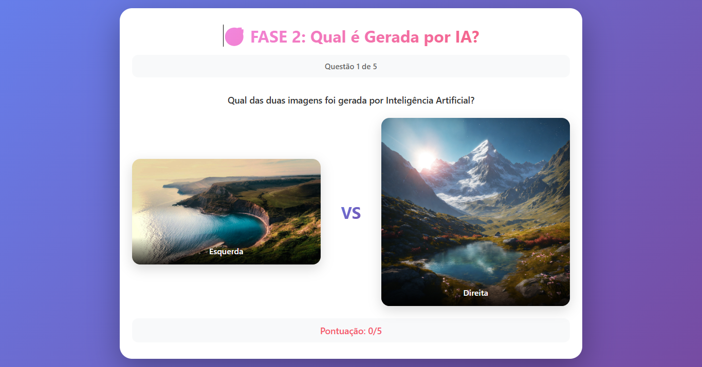
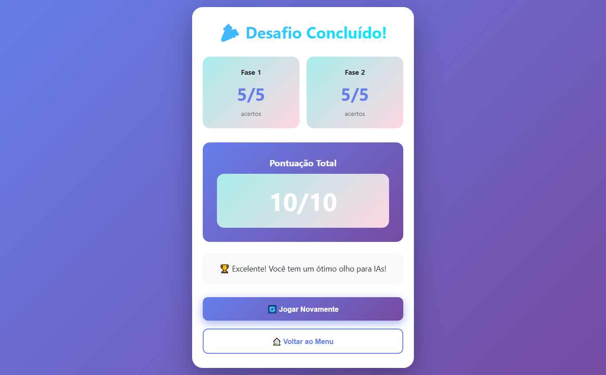

# 🎨 Natty or Not? - Desafio de Autenticidade com IA

[](https://github.com/thiagojordao98/lab-natty-or-not/actions/workflows/deploy.yml)
[](https://thiagojordao98.github.io/lab-natty-or-not)

## 🎮 [Jogue Agora!](https://thiagojordao98.github.io/lab-natty-or-not)

## 📒 Descrição

Um **jogo interativo web** desenvolvido em **React + TypeScript** que desafia jogadores a identificar se uma imagem foi criada por um humano ou gerada por Inteligência Artificial.

Este projeto mergulha na temática central do Lab DIO: **"Natty or Not?"** - questionando os limites entre criatividade humana e artificial através de 2 fases desafiadoras com imagens reais!

### 🎮 Como Funciona

**Fase 1 - Identificação Individual**
- Analise uma imagem
- Decida: É IA ou Real?
- 5 questões para testar seu olhar

**Fase 2 - Comparação Direta**  
- Compare duas imagens lado a lado
- Identifique qual foi gerada por IA
- 5 duelos mais difíceis!

## 🤖 Tecnologias Utilizadas

### Frontend
- **React 18** - Biblioteca JavaScript para interfaces
- **TypeScript** - Tipagem estática para JavaScript
- **CSS3** - Estilização moderna com gradientes e animações
- **Create React App** - Configuração e build

### Fontes de Imagens
- **Pexels** - Fotografias reais profissionais
- **Lexica Art** - Imagens geradas por Stable Diffusion (IA)

### Conceitos de IAs Mencionadas
- Midjourney (geração de imagens)
- DALL-E 3 (síntese de imagem)
- Stable Diffusion (difusão latente)
- Leonardo.AI (criação artística)

## 🧐 Processo de Criação

1. **Planejamento da Estrutura**:
   - Defini 2 fases de dificuldade progressiva
   - Selecionei imagens ambíguas (difíceis de distinguir)
   - Criei sistema de pontuação e feedback

2. **Desenvolvimento React**:
   - Componentização (Phase1Game, Phase2Game)
   - Gerenciamento de estado com hooks (useState)
   - TypeScript para type safety
   - Lógica de embaralhamento de questões

3. **Design e UX**:
   - Gradientes vibrantes diferentes para cada fase
   - Animações CSS (pulse, shake, fadeIn)
   - Feedback visual imediato (verde/vermelho)
   - Layout responsivo para mobile

4. **Dados do Jogo**:
   - 5 imagens reais do Pexels
   - 5 imagens de IA do Lexica
   - Sistema de geração aleatória de questões
   - Embaralhamento para evitar padrões

## 🚀 Resultados

✅ **Aplicação Web Completa**: Jogo totalmente funcional e interativo

✅ **2 Fases Progressivas**: Do simples ao complexo

✅ **10 Imagens Reais**: Mix de fotos reais e geradas por IA

✅ **Sistema de Pontuação**: Tracking de acertos em tempo real

✅ **UI/UX Profissional**: Design moderno com animações suaves

✅ **Responsivo**: Funciona em desktop, tablet e mobile

### Recursos Implementados:
- ✨ Menu inicial atraente com animações
- 🎯 Fase 1: Identificação individual (5 questões)
- 🎯 Fase 2: Comparação lado a lado (5 questões)
- 📊 Tela de resultados com pontuação total
- 🔄 Opção de jogar novamente
- 📱 Design responsivo
- ⚡ Feedback visual instantâneo
- 🎨 Gradientes e animações CSS

### 📸 Screenshots do Jogo:

**Menu Inicial**



**Fase 1 - Identificação Individual**



**Fase 2 - Comparação Lado a Lado**



**Tela de Resultados**



## 💭 Reflexão

**O Desafio de Criar um "Natty or Not" Interativo**

Este projeto captura perfeitamente a essência do desafio DIO:

1. **Questiona Percepção**: Força o jogador a analisar criticamente cada detalhe

2. **Revela Limitações Humanas**: Muitas vezes é IMPOSSÍVEL distinguir - e isso é fascinante!

3. **Educação através do Jogo**: Ensina sobre IAs de forma divertida e envolvente

4. **Tecnologia Atual**: Usa ferramentas modernas (React/TS) para demonstrar conceito de IA

5. **Experiência Completa**: Não é apenas um quiz, é uma jornada de descoberta

**Principais Aprendizados**:

- IAs generativas já produzem resultados indistinguíveis de fotos reais
- Pequenos detalhes podem revelar a origem (mas nem sempre!)
- A linha entre "natty" e "not natty" está cada vez mais tênue
- TypeScript + React oferecem excelente developer experience
- Gamificação torna aprendizado sobre IA mais acessível

**A Verdade Provocadora**: Em muitos casos, até especialistas erram. O futuro não é "IA vs Humano", mas **"IA + Humano"** criando juntos! 🚀

---

## 📚 Como Executar o Projeto

### Pré-requisitos
- Node.js 16+ instalado
- npm ou yarn

### Instalação e Execução

```bash
# Clone o repositório
git clone https://github.com/seu-usuario/lab-natty-or-not.git

# Navegue até a pasta do projeto React
cd lab-natty-or-not/natty-or-not-react

# Instale as dependências
npm install

# Execute o projeto
npm start
```

O jogo abrirá automaticamente em `http://localhost:3000`

### Build para Produção

```bash
npm run build
```

## 🎮 Estrutura do Projeto

```
natty-or-not-react/
├── src/
│   ├── components/
│   │   ├── Phase1Game.tsx      # Fase 1: Identificação
│   │   ├── Phase1Game.css
│   │   ├── Phase2Game.tsx      # Fase 2: Comparação
│   │   └── Phase2Game.css
│   ├── App.tsx                 # Componente principal
│   ├── App.css
│   ├── gameData.ts             # Dados das imagens e lógica
│   ├── index.tsx
│   └── index.css
├── public/
│   └── index.html
├── package.json
└── tsconfig.json
```

## 🔮 Evolução Futura

- [ ] Adicionar mais categorias (retratos, arte, arquitetura)
- [ ] Sistema de ranking online
- [ ] Modo multiplayer em tempo real
- [ ] Integração com APIs de IA para gerar novas imagens
- [ ] Explicações detalhadas sobre cada imagem
- [ ] Modo tutorial com dicas visuais
- [ ] Compartilhamento de resultados nas redes sociais
- [ ] Desafios diários

## 🤝 Tecnologias e Recursos

- [React](https://react.dev/)
- [TypeScript](https://www.typescriptlang.org/)
- [Pexels](https://www.pexels.com/) - Imagens Reais
- [Lexica](https://lexica.art/) - Imagens de IA

---

**Made for #LabDIONattyOrNot** 🚀

*A fronteira entre o natural e o artificial nunca foi tão interessante* 🎨🤖
